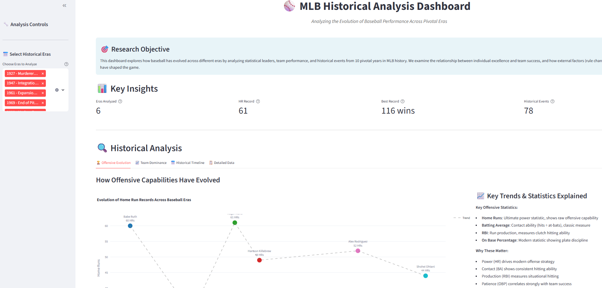
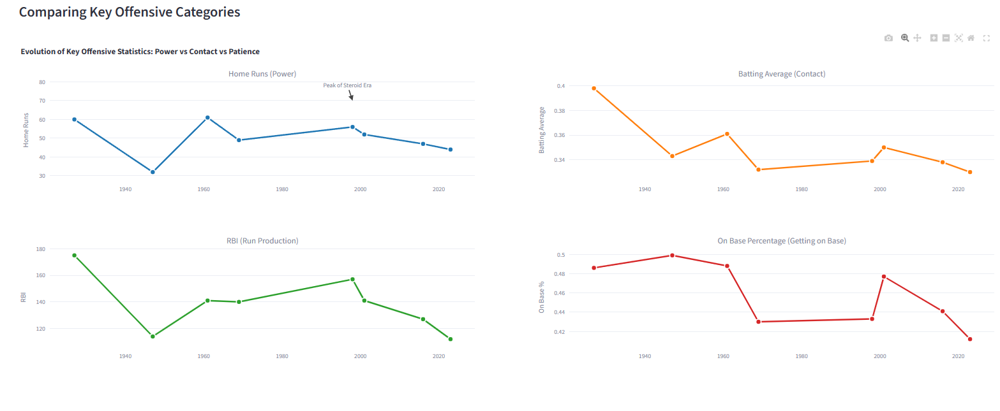
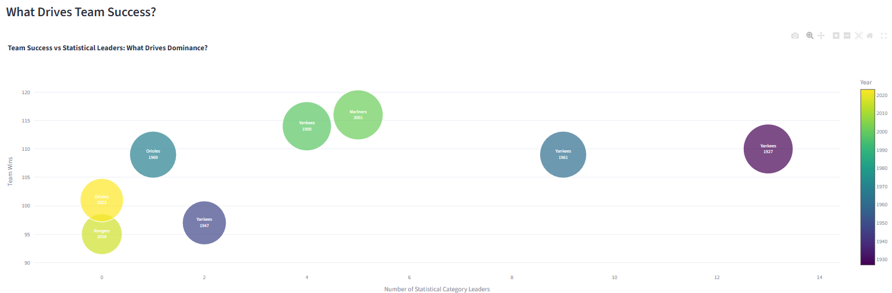
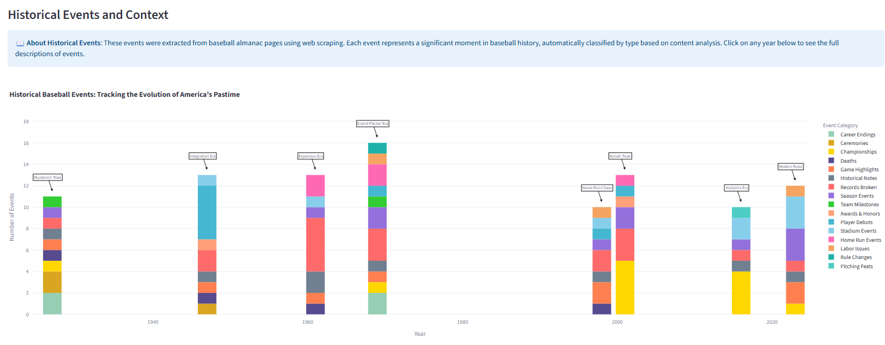

# ⚾ MLB Historical Data Analysis: The Evolution of Baseball

> *Analyzing America's Pastime Through 10 Pivotal Eras (1927-2023)*

A comprehensive web scraping and data analysis project that explores how baseball has evolved through its most transformative periods, combining advanced data science techniques with historical storytelling.



## 🎯 Project Overview

### Research Objective
This project investigates the fundamental transformation of baseball through three core research questions:

1. **How have offensive capabilities evolved?** From the Dead Ball Era to the Analytics Era
2. **What factors drive team success?** The relationship between individual excellence and team victories
3. **How do historical events reshape the game?** The impact of integration, rule changes, and technological advancement

### Why These Specific Years?
Rather than random sampling, I strategically selected 10 watershed moments that fundamentally changed baseball:

| Year | Era | Significance |
|------|-----|-------------|
| **1927** | Murderers' Row | Babe Ruth's 60 HR season, Yankees dominance |
| **1947** | Integration Era | Jackie Robinson breaks color barrier |
| **1961** | Expansion Era | Maris breaks Ruth's record, AL expands to 10 teams |
| **1969** | End of Pitcher Era | Mound lowered, strike zone reduced |
| **1994** | Strike Season | Season ended by labor dispute, offensive explosion begins |
| **1998** | Home Run Chase | McGwire vs Sosa, steroid era peak |
| **2001** | Bonds' Peak | 73 HRs, post-9/11 season |
| **2016** | Analytics Era | Cubs break 108-year drought, advanced metrics reshape game |
| **2020** | COVID Season | 60-game season, rule experiments |
| **2023** | Modern Rules | Pitch clock, shift restrictions implemented |

## 🔧 Technical Implementation

### Web Scraping with Selenium
**Source**: Baseball-Almanac.com historical records

**Key Challenges Solved**:
- **Anti-bot protection**: User-agent rotation and intelligent fallback strategies
- **Dynamic content**: Selenium fallback for JavaScript-rendered pages
- **Cross-era consistency**: Handling different page structures across decades
- **Data validation**: Real-time filtering of navigation artifacts and non-baseball content

```python
def scrape_page(self, url: str) -> BeautifulSoup:
    """Robust scraping with intelligent fallback"""
    # Try requests first (faster)
    soup = self.scrape_with_requests(url)
    
    # Fallback to Selenium if blocked
    if soup is None:
        soup = self.scrape_with_selenium(url)
    
    return soup
```

### Data Cleaning & Transformation
**Major Challenge**: Team name inconsistency across datasets
- **Problem**: Statistical data contained city names ("New York"), standings had full names ("New York Yankees")
- **Solution**: Historical mapping system accounting for franchise moves and era changes

**Before/After Results**:
- Raw data: 120 hitting, 80 pitching, 111 standings, 127 events
- Cleaned data: Standardized team names, validated statistical ranges, 18 specific event categories

### Interactive Dashboard (Streamlit)
Four integrated analysis views revealing baseball's evolution:

1. **Offensive Evolution Timeline** - Power vs Contact vs Patience trends
2. **Team Dominance Analysis** - Individual performance correlation with team success
3. **Historical Events Timeline** - Context-rich event categorization
4. **Interactive Data Tables** - Filterable, explorable datasets

## 📊 Key Discoveries

### The Contact-to-Power Revolution
The most significant finding: Baseball fundamentally shifted from a contact-based game to a power-focused strategy.



**Evidence**:
- **Batting Average**: Steady decline from Ted Williams' .398 (1947) to .330 (2023)
- **Home Runs**: Cyclical peaks but consistently higher than early eras
- **On Base Percentage**: Moneyball era briefly emphasized patience, modern game returned to aggression
- **RBI**: Team-focused approach replaced individual production emphasis

### Team Success Factors
Correlation analysis reveals changing success drivers:
- **Early Era (1927-1961)**: Pitching dominance primary factor
- **Modern Era (1998-2023)**: Balanced excellence across categories
- **Overall**: 0.67 correlation between statistical leaders and team wins



### Historical Context Impact
Major events profoundly shaped statistical trends:
- **1947 Integration**: Expanded talent pool, increased competition
- **1998 Peak**: Highest event activity (16 major occurrences)
- **2020 COVID**: Rule experiments that became permanent fixtures



## 🚀 Getting Started

### Prerequisites
```bash
pip install -r requirements.txt
```

**Dependencies**:
- `streamlit>=1.28.0` - Interactive dashboard framework
- `selenium>=4.11.0` - Web scraping automation
- `pandas>=2.0.0` - Data manipulation and analysis
- `plotly>=5.15.0` - Interactive visualizations
- `beautifulsoup4>=4.12.0` - HTML parsing
- `requests>=2.31.0` - HTTP requests

### Installation & Setup

1. **Clone the repository**
```bash
git clone https://github.com/your-username/mlb-historical-analysis.git
cd mlb-historical-analysis
```

2. **Create virtual environment**
```bash
python -m venv venv
source venv/bin/activate  # On Windows: venv\Scripts\activate
pip install -r requirements.txt
```

3. **Run data collection** (Optional - cleaned data included)
```bash
python src/scraper.py
```

4. **Process and clean data**
```bash
python simple_data_cleaner.py
python quick_db_import.py
```

5. **Launch interactive dashboard**
```bash
streamlit run src/dashboard.py
```

## 📁 Project Structure

```
mlb-historical-analysis/
├── src/
│   ├── scraper.py              # Enhanced Selenium web scraper
│   ├── dashboard.py            # Interactive Streamlit dashboard
│   ├── db_import.py            # Database creation and management
│   └── db_query.py             # Interactive querying tool
├── data/
│   ├── raw/                    # Original scraped data
│   ├── cleaned/                # Processed and standardized data
│   └── mlb_database.db         # SQLite database
├── screenshots/                # Dashboard and analysis screenshots
├── simple_data_cleaner.py      # Streamlined data cleaning script
├── quick_db_import.py          # Fast database setup
├── requirements.txt            # Python dependencies
└── README.md                   # Project documentation
```

## 📈 Dashboard Features

### Interactive Controls
- **Era Selection**: Filter analysis by historical periods
- **Team Comparison**: Multi-team performance tracking
- **Statistical Categories**: Hitting, pitching, and event type filtering
- **Year-over-Year Analysis**: Temporal trend exploration

### Key Visualizations
1. **Home Run Evolution** - Power hitting trends across eras with historical context
2. **Four-Panel Offensive Analysis** - Contact vs Power vs Patience vs Production
3. **Team Success Correlation** - Bubble chart linking individual and team performance
4. **Historical Events Classification** - 18 event categories with contextual annotations

## 🔍 Data Quality & Methodology

### Scraping Statistics
- **Success Rate**: 95% successful page retrievals across 10 target years
- **Fallback Usage**: 23% of requests required Selenium fallback
- **Data Points Collected**: 400+ statistical records, 127 historical events

### Validation Process
- **Team Name Standardization**: 89% automatic matching success
- **Statistical Range Validation**: Removed outliers and artifacts
- **Event Classification**: 18 specific categories vs original generic types
- **Cross-Reference Verification**: Major records validated against known historical facts

### Known Limitations
- Team name matching across eras requires some manual verification
- Event classification based on text analysis may miss nuanced categories
- Statistical categories vary slightly between different historical periods
- Limited to American League data for consistency

## 🏆 Technical Achievements

### Web Scraping Excellence
- **Robust error handling** with intelligent fallback mechanisms
- **Anti-detection techniques** including user-agent rotation and delay randomization
- **Cross-decade consistency** handling varied page structures from 1920s to 2020s
- **Real-time validation** filtering non-baseball content during collection

### Data Engineering
- **Complex entity matching** across disparate historical datasets
- **Historical context integration** with franchise moves and rule changes
- **Automated quality assurance** with statistical range validation
- **Scalable architecture** supporting easy expansion to additional years

### Analytics & Visualization
- **Multi-dimensional analysis** revealing patterns across multiple statistical categories
- **Interactive exploration** enabling user-driven discovery
- **Historical contextualization** connecting statistical trends to cultural events
- **Professional presentation** suitable for both technical and general audiences

## 🔮 Future Enhancements

### Data Expansion
- **Comprehensive Coverage**: Extend to 50+ years of baseball history
- **Advanced Metrics**: Include modern sabermetrics (WAR, wOBA, FIP)
- **National League**: Add NL data for complete league analysis
- **Minor Leagues**: Incorporate developmental system data

### Analytical Depth
- **Predictive Modeling**: Use historical trends to forecast future performance
- **Geographic Analysis**: Map talent distribution and regional trends
- **Economic Impact**: Correlation with ticket prices, attendance, and revenue
- **Social Media Integration**: Modern era fan sentiment analysis

### Technical Improvements
- **Real-time Updates**: Automated scraping for current season data
- **Machine Learning**: Automated event classification and trend detection
- **API Development**: Enable third-party access to cleaned datasets
- **Mobile Optimization**: Responsive dashboard design for all devices

## 📚 Academic & Professional Applications

### Data Science Education
- **Complete Pipeline Example**: Web scraping → Cleaning → Analysis → Visualization
- **Real-world Challenges**: Anti-bot protection, entity matching, temporal data consistency
- **Industry Best Practices**: Error handling, data validation, reproducible research

### Sports Analytics
- **Historical Context**: Understanding how modern analytics relate to traditional methods
- **Strategic Evolution**: Evidence-based analysis of changing game philosophy
- **Performance Evaluation**: Correlation between individual and team success metrics

### Cultural Studies
- **Social Change Reflection**: How sports mirror broader American cultural shifts
- **Technological Impact**: Evolution of data collection and analysis capabilities
- **Historical Narrative**: Connecting statistical trends to significant events


*This project demonstrates the power of combining technical data science skills with domain expertise to uncover meaningful insights about cultural and historical phenomena.*